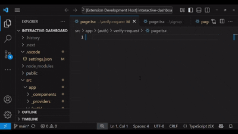
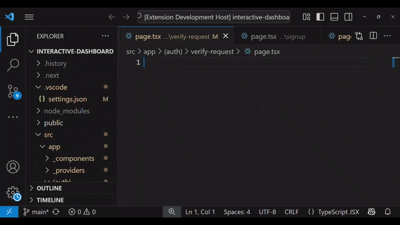
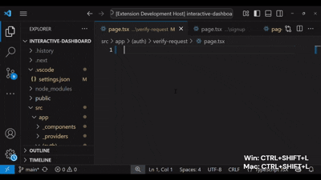

# React NextJs Smart Snippets

Snippets with brains and workspace intellisense. Boost your React, Next.js, Typescript and JavaScript development with a powerful VS Code extension offering a wide range of snippets. This extension leverages workspace IntelliSense for dynamic naming and adopts a modern approach for consistency.

## Features

- **Workspace IntelliSense:** Automatically generates suitable names (e.g., UserContext from app/user-context.tsx or page.tsx in /signup becomes SignupPage) or based on current file name and paths.
- **Modern Approach:** Uses contemporary React hooks, TypeScript typing, and Next.js conventions for a consistent coding experience.
- **Extensive Snippet Library:** Includes basic and complex snippets for components, hooks, context providers, and Next.js directives.
- **Import Management:** Organizes imports automatically on insertion.
- **Directive Handling:** Moves "use client" and "use server" to the top of files on save.
- **Quick Pick Support**: Access all snippets via a command palette with customizable shortcuts.

## Installation

1. Open VS Code.
2. Go to the Extensions view (`Ctrl+Shift+X` or `Cmd+Shift+X` on Mac).
3. Search for "React Next.js Smart Snippets".
4. Click Install.
5. Reload VS Code if prompted.

## Usage

### Triggering Snippets

- Type a prefix (e.g., `rfc`, `ccp-ts`) and press Enter or Tab to insert.

#### OR

- Use the Quick Pick feature:
  - On Windows: Hold down `Ctrl+Shift+L`
  - On Mac: Hold `Cmd+Shift+L`
  - Select a snippet from the list that appears.

### Available Snippets

These are some of the snippets available.

| Prefix         | Description                                            |
| -------------- | ------------------------------------------------------ |
| `iif`          | Immediately Invoked Function (IIFE)                    |
| `iif-async`    | Immediately Invoked Asynchronous Function (IIFE)       |
| `iif-ar`       | Immediately Invoked Arrow Function (IIFE)              |
| `iif-ar-async` | Immediately Invoked Asynchronous Arrow Function (IIFE) |
| `rfc`          | React Functional Component (JS)                        |
| `rfc-ts`       | React Functional Component (TS)                        |
| `rfc-de`       | Default Export Functional Component (JS)               |
| `rfc-ts-de`    | Default Export Functional Component (TS)               |
| `us`           | useState Hook                                          |
| `uef`          | useEffect Hook                                         |
| `ucb`          | useCallback Hook                                       |
| `ulef`         | useLayoutEffect Hook                                   |
| `ume`          | useMemo Hook                                           |
| `ure`          | useReducer Hook                                        |
| `uref`         | useRef Hook                                            |
| `uclient`      | "use client" Directive                                 |
| `userver`      | "use server" Directive                                 |
| `im-server-o`  | import server-only                                     |
| `im-n`         | Import Next.js                                         |
| `im-pt`        | Import PropTypes                                       |
| `im-r`         | Import React                                           |
| `im-c`         | Import Component from React                            |
| `im-pc`        | Imports Component and PureComponent from React         |
| `im-us`        | Import useState                                        |
| `im-ue`        | Import useEffect                                       |
| `im-ur`        | Import useRef                                          |
| `im-rd`        | Import ReactDOM Client                                 |
| `hocc`         | Higher-order class component (JS)                      |
| `hocc-ts`      | Higher-order class component (TS)                      |
| `hofc`         | Higher-order function component (JS)                   |
| `hofc-ts`      | Higher-order function component (TS)                   |
| `tcp`          | Theme Provider Context                                 |
| `ntcp`         | Next Theme Provider                                    |

**Note:** Not all snippets were shown in the above, to view more snippets you can hold the `Ctrl+Shift+L` on windows or `Cmd+Shift+L` on Mac

## Short Terms Explained

`ar`: Arrow function

`arfc`: Arrow Function Component

`ts`: TypeScript

`de`: Default Export

`async`: Asynchronous

`im`: Import

## Basic Snippets

These snippets are ideal for quick setup of common patterns:

Immediately Invoked Functions: Start with `iif`, `iif-async`, `iif-ar`, or `iif-ar-async` for self-executing functions.
Example (`iif`): `(function () { // Your logic goes in here; return null })();`

React Functional Components: Use `rfc` or `rfc-ts` for basic components, and `rfc-de` or `rfc-ts-de` for default exports.

Example (`rfc-ts`):

```typeScript
interface ComponentNameProps {
  // Define props here
}
export function ComponentName(props: ComponentNameProps) {
  return (
  <div>
    <h1>ComponentName</h1>
  </div>
  );
}
```

Next.js Components: Leverage `uclient` or `userver` for client/server directives in Next.js pages or even `im-server-o` to import server-only directive.



## Complex Snippets

For advanced use cases, try these:

Theme Provider Context: Use `ccp-ts` or `fcp-ts` to create typed context providers.

Example (`fcp-ts` in `theme-context.tsx`):

```typescript
import React, { createContext, useState, useContext } from "react";
interface ThemeState {
  data: Record<string, unknown>;
}
const ThemeContext = createContext<ThemeState | null>(null);
interface ThemeProviderProps {
  children: React.ReactNode;
}
export const ThemeProvider: React.FC<ThemeProviderProps> = ({ children }) => {
  const [state] = useState<ThemeState>({ data: {} });
  return (
    <ThemeContext.Provider value={state}>{children}</ThemeContext.Provider>
  );
};
export const useTheme = (): ThemeState => {
  const ctx = useContext(ThemeContext);
  if (!ctx) throw new Error("useTheme must be used within a ThemeProvider");
  return ctx;
};
```



Next.js Theme Provider: Combine with `uclient` for client-side theme management in Next.js.

## Quick Pick Feature

Access all snippets via the Quick Pick menu:
Trigger: `Ctrl+Shift+L` (Windows) or `Cmd+Shift+L` (Mac).
Customization: If there's a shortcut conflict or you want to customize:
Open VS Code (`Ctrl+K Ctrl+S` or `Cmd+K Cmd+S`).

Search for "React Next.js Smart Snippets".

Edit the keybinding (e.g., change to `Ctrl+Alt+L`) and save.



## Formatter Recommendation

This extension is not a substitute for a language formatter like Prettier. For optimal results:

Set Up Prettier:

Install Prettier: `npm install -D prettier`

Create `.prettierrc`:

```json
{
  "importOrder": ["use client", "use server", "^react$", "^next$", "^[./]"],
  "importOrderSeparation": true
}
```

Install the Prettier - Code Formatter extension.

**Also**

Set Up ESLint:
Install ESLint: `npm install -D eslint`

Create .eslintrc.json:

```json
{
  "rules": {
    "import/no-duplicates": "error",
    "sort-imports": ["error", { "ignoreDeclarationSort": false }]
  }
}
```

Install the ESLint extension.

Add to VS Code settings (**settings.json**):

```json
"editor.codeActionsOnSave": {
  "source.organizeImports": true,
  "source.fixAll.eslint": true
},
"editor.formatOnSave": true
```

## Requirements

- VS Code `1.70.0` or later.
- Node.js and pnpm for development (if contributing).

## Release Notes

### 1.0.0

- Initial release with a comprehensive set of React/Next.js snippets.

- Added dynamic naming, import organization, and directive positioning.

## Following extension guidelines

Ensure that you've read through the extensions guidelines and follow the best practices for creating your extension.

- [Extension Guidelines](https://code.visualstudio.com/api/references/extension-guidelines)

## About the Author

- X: https://x.com/morse_code_001

- LinkedIn: https://www.linkedin.com/in/victor-okenwa/

- Support Me: Buy me a coffee on Patreon https://patreon.com/morse_code

## Feedback

Please review this extension on the VS Code Marketplace to help improve it! Your feedback is greatly appreciated.

**Enjoy!**
